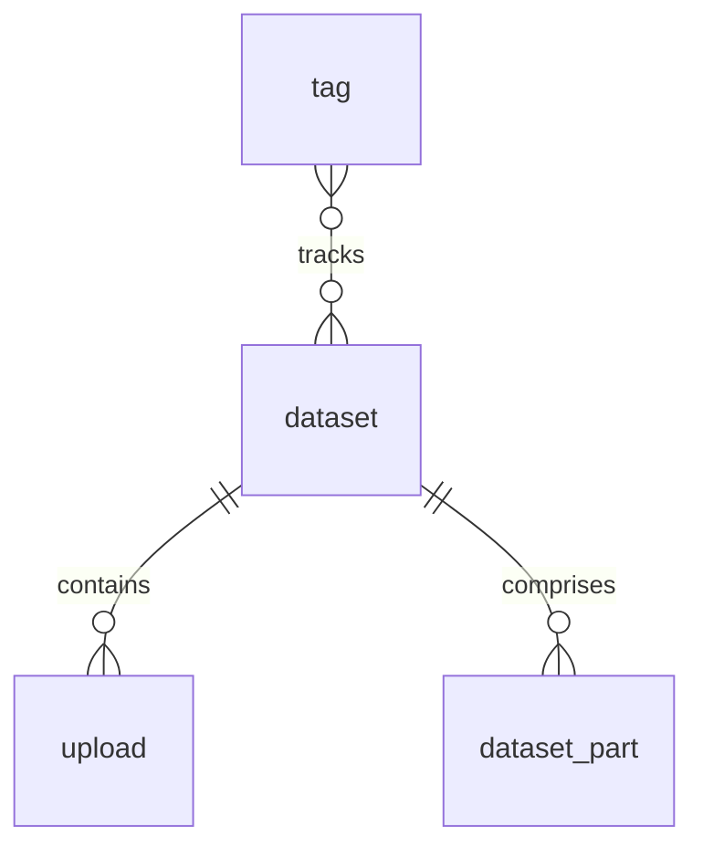

# Design

## Architecture decisions

### Federation

We use Bittorrent as a distributed storage medium,
not because it's necessarily the best thing
or specifically engineered for that purpose
but because it's robust and works in a wide array of different environments
without much up-front investment in setup.
We still need some way for people
to share & discover torrents in the first place,
and that's Sciop:
it's our catalogue and curation platform,
built on the [FAIR principles][]:
metadata that is Findable, Accessible, Interoperable and Reusable.

Now we have redundancy in the data storage
but the catalogue becomes a single point of failure;
that's where federation comes in.
We can't make the catalogue completely decentralised
because you still need one or more routes into it,
but we can create resilience through redundancy.
Our metadata is designed to be Interoperable,
so we can use Activity Pub to distribute across
multiple independent instances for resilience.

That enables some other cool stuff too.
People can host their own instances and make their own decisions about scope.
We can share the work of moderation & curation across the network,
just as Fediverse apps like Mastodon already do.
But fundamentally,
it's about making too many copies to allow easy censorship or control.

[FAIR principles]: https://www.go-fair.org/fair-principles/

## Full database diagram

!!! note
	This has been auto-generated from the SQLite database.
	It isn't laid out very sensibly,
	and is probably out of date,
	but may be helpful anyway.
	
	Click on the image to zoom in.
	

