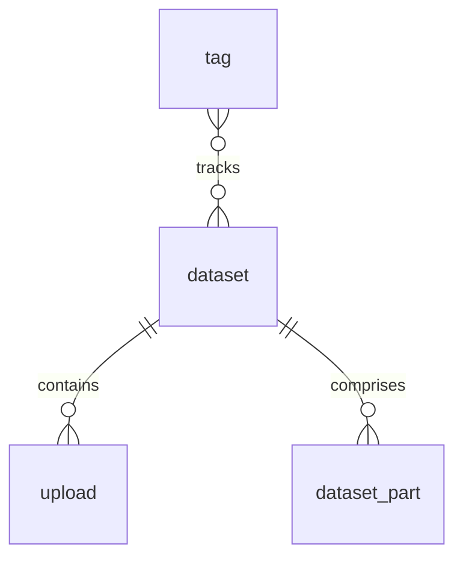
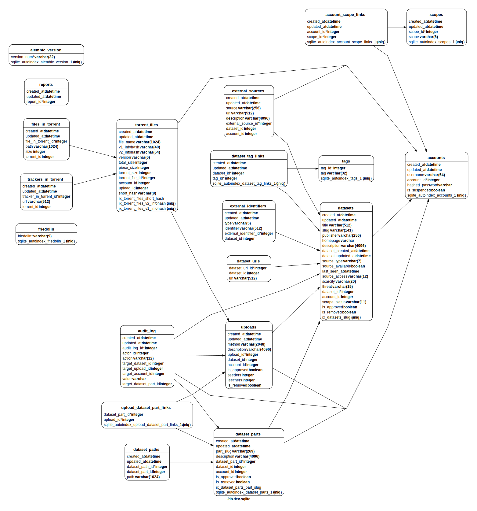

# Design

## Full database diagram

!!! note
	This has been auto-generated from the SQLite database.
	It isn't laid out very sensibly,
	and is probably out of date,
	but may be helpful anyway.
	
	Click on the image to zoom in.
	

