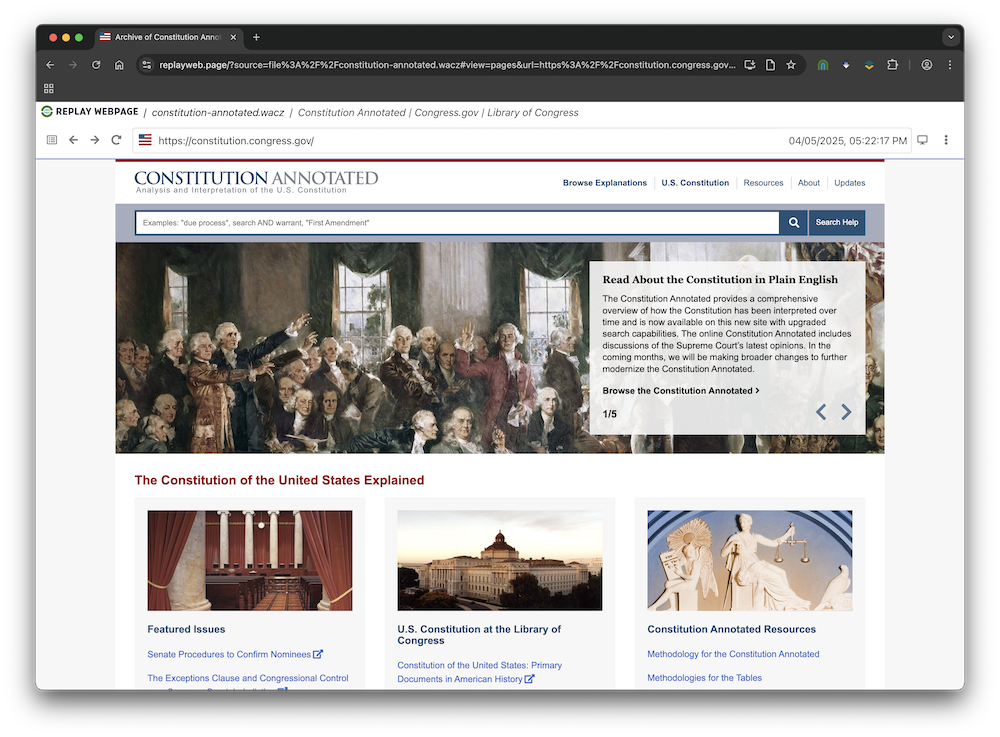

# Archiving Web Pages

There are many ways to to archive web pages. The choice of what tool to use will be determined by a few factors, such as the nature of the web content you are collecting, how you would like to use the collected content, and how easy it is to install and maintain a given tool. You may find yourself wanting to use different tools in different situations. This is the way.

As you get started archiving web content it can be helpful to ask yourself a few questions:

1. **Does the website use JavaScript to render web pages?** Turn off JavaScript in your browser and see how the site looks and navigates. If the site looks very different, or is significantly impaired, you will want to use a "browser-based" crawler like [zimit] or [browsertrix-crawler]. If the answer is no, then a tool like [wget], [httrack] or [heretrix] will probably work just fine.
2. **Does the site require user interaction?** Some websites provide interfaces that only load content when you click on buttons or otherwise interact with page components that aren't links. If your site requires interaction when archiving you will want to look at a tool like [ArchiveWebPage] that lets you create an archive as you interact with the site. If you need to do this at scale for a large site you can consider using [browsertrix-crawler] which includes behaviors such as playing video, or infinite scrolling, as well as platform specific behaviors (Instagram, Twitter). It also lets you create your own custom behavior that run as part of the crawl.
3. **What do you want to do with the data?** If you want provide an archive that can be easily viewed and republished on the web, you will probably want to use tools that can output [WACZ] or [ZIM] files, such as [browsertrix-crawler] or [zimit]. If you want to generate [WARC] files for delivery to a web archive like the Internet Archive you can use [wget], [heretrix], [browsertrix-crawler], and [zimit]. And if you simply want to access the collected files *as files* independently of how they looked on the web (e.g. PDF, CSV, JPEG) you can use tools like [wget] and [httrack], or even your own custom scraping programs.

Read on for some examples on how to use some of these tools.

## Using browsertrix-crawler

[browsertrix-crawler] can generate near-full fidelity copies of a webpage, including server-dependent parts.
It does this by running a full browser and simulating browsing activity, 
and generating [WACZ] files that are easy to view locally on your computer with [ArchiveWebPage] 
and publishable anywhere on the web with the [ReplayWebPage] web component. 
Using [browsertrix-crawler] gives you full access to all the [options] for controlling how the crawl is performed, 
where the data is written (e.g. local disk, or object storage) and knobs for pausing, 
interrupting and resuming crawls, 
watching a screencast of the crawling, 
using a custom browser profile for sites that require a login (be careful!), and more.

The [WACZ] files that browsertrix-crawler creates are perfect for making available as a torrent, since they are just ZIP files (try to unzip one by changing the file extension to .zip and double clicking on it). Each WACZ contains:

* the archived content stored as [WARC] files
* package metadata (JSON) which includes a manifest of the package contents (filenames and checksums) as well as descriptive metadata about the contents of the archive (title, description, etc)
* indexes (CDX) that provide fast random access by URL and time stamp to the content in the WARC files
* screenshots of each page can optionally be created as part of the crawl
* extracted text from the rendered page can also be created as part of the crawl

Getting started with [browsertrix-crawler] requires that you first install [Docker]. 
Once installed you can crawl a site, with some standard options: 

```shell
docker run \
    --volume ./crawls:/crawls \
    --publish 9037:9037 \
    webrecorder/browsertrix-crawler:latest crawl \
    --workers 4 \
    --collection constitution-annotated \
    --seeds "https://constitution.congress.gov/" \
    --scopeType domain \
    --title "Contitution Annotated" \
    --description "Constitution Annotated provides a legal analysis and interpretation of the United States Constitution based on a comprehensive review of Supreme Court case law and, where relevant, historical practices that have defined the text of the Constitution." \
    --exclude '.*add-to-cart=[0-9]*' \
    --screenshot thumbnail \
    --text final-to-warc \
    --generateWACZ \
    --screencastPort 9037
```

These options are similar to zimit, but there are a lot more possibilities:

  - `--volume ./crawls:/output` says to bind the `crawls` directory to what Docker thinks of as its `/crawls` directory, which is where browsertrix-crawler will write all its data.
  - `--publish 9037:9037` binds the local port 9037 to the port 9037 of the Docker container, which is the port browsertrix-crawler will make a screencast of its activity available.
  - `--workers 4` means to run 4 browsers concurrently to crawl the website.
  - `--seeds https://constitution.congress.gov` is the web site to scrape. It is possible to have multiple web sites, comma separated
  - `--scopeType host` says to crawl the constitution.congress.gov site, but there are other options ranging from a single page to an entire domain.
  - `--collection constitution-annotated` is the name of the collection which will be used to create a subdirectory in `./crawls/collections/` where the archived data will live.
  -  `--title` is the name of the archive, which will go in the package metadata
  - `--description` a description of the archive which will go in the package metadata
  - `--exclude` is a regular expression to exclude certain URLs. Necessary in this case so that the shopping cart section of the web site does not create an infinitely recursive scrape
  - `--screenshot` says to create thumbnail screenshots of each page, which are put into a separate WARC file
  - `--text` says to extract the text from each rendered page and save to a WARC file, which can be useful for search
  - `--generateWACZ` indicates that a WACZ archive should be written using the collection name in `./crawls/collections/`
  - `--screencastPort` 9037 says to make a screencast of the different worker browsers available on port 9037. If you've used `--publish` above then you'll be able to open http://localhost:9037 in your browser and watch the crawl!

[](../img/btrix.gif)

Once your crawl is complete you should be able to find the WACZ file at `crawls/collections/constitution-annotated/constitution-annotated.wacz`. This contains all the archived content and metadata in a ZIP file. You can unzip it with standard zip tools if you want to see what it contains. It is perfect for making available as a torrent, and if you want you can use the client-side JavaScript application at https://replayweb.page to view the contents.

[](../img/replaywebpage.png)

The [browsertrix-crawler documentation] includes information for setting the length and size of the crawl, where to write the crawl, and the types of behaviors that it uses when viewing a page. You can even create (and publish) your own custom behaviors for archiving particular sites.

!!! tip "Rescuing failed crawls"

    If your crawl fails midway through and it would be prohibitive to run again, or the errors happen on every crawl,
    see the section below on [rescuing output from a crashed crawl](#rescuing-output-from-a-crashed-crawl)

## Using zimit

Another way to archive web pages, produce [WARC] files and `.zim` files is using the [Zimit] tool which bundles both `Browsertrix` and `warc2zim` in a Docker image.[^docker]

!!! tip

    `zimit` at the moment is slightly buggier than the direct `browsertrix` method above, so we recommend that route,
    but the two are compatible: zimit just produces an extra `zim` version of the [WARC] files.

The steps are:

  1. Install docker in whatever way your operating system wants you to. Debian or Ubuntu systems might do `apt install docker.io`
  2. Obtain the `zimit` image: `docker pull ghcr.io/openzim/zimit`

Now we assume you are working in a particular directory, say, `/home/name/scraping` that we will call `$SCRAPE`

First run the scrape. We will use the https://constitution.congress.gov/ web site as an example.

```shell
docker run \
    -v ${SCRAPE}:/output \
    ghcr.io/openzim/zimit zimit \
    -w 12 \
    --seeds https://constitution.congress.gov/
    --name constitution-annotated-20250310 \
    --title "Constitution Annotated" \
    --description "Constitution Annotated provides a legal analysis and interpretation of the United States Constitution based on a comprehensive review of Supreme Court case law and, where relevant, historical practices that have defined the text of the Constitution." \
    --scopeExcludeRx '.*add-to-cart=[0-9]*' \
    --keep
```

This needs some explanation.

  - `-v ${SCRAPE}:/output` says to bind what Docker thinks of as the output directory to the working directory.
  - `-w 12` means to run 12 scraping threads concurrently. On our machine, this is the number of CPU cores.
  - `--seeds https://constitution.congress.gov` is the web site to scrape. It is possible to have multiple web sites, comma separated
  - `--name constitution-annotated-20250310` is the filename for the output `.zim` file
  - `--title` and `--description` go in the `.zim` file metadata
  - `--scopeExcludeRx` is a regular expression to exclude certain URLs. Necessary in this case so that the shopping cart section of the web site does not create an infinitely recursive scrape
  - `--keep` causes `zimit` to keep intermediate files. In particular, it keeps the [WARC] files which we also want.

### Rescuing output from a crashed crawl

Doing this archived the web site but failed at the very end. 
The reason is yet undiagnosed but we suspect it to have to do with `zimit`'s management of concurrency. 
No matter, the [WARC] files are saved in a temporary directory that starts with `.tmp` followed by some random characters, 
in this case `.tmptp8i9y5f`

We can work around this by looking in the temporary directory for the [WARC] files, and running `warc2zim`:

```shell
ls .tmptp8i9y5f/collections/crawl-20250310121334268/archive/*.warc.gz | sed s@^@/output/@ > /tmp/scrape.$$

docker run \
    -v ${SCRAPE}:/output \
    ghcr.io/openzim/zimit warc2zim \
    --name constitution-annotated-20250310 \
    --title "Constitution Annotated" \
    --description "Constitution Annotated provides a legal analysis and interpretation of the United States Constitution based on a comprehensive review of Supreme Court case law and, where relevant, historical practices that have defined the text of the Constitution." \
    --zim-file /output/constitution-annotated-20250310.zim \
    `cat /tmp/scrape.$$`

rm /tmp/scrape.$$
```

Now we can assemble the archive, ready for [uploading](../uploading/index.md),

```shell
mkdir archive
mv constitution-annotated-20250310.zim archive
mv .tmptp8i9y5f/collections/crawl-20250310121334268/archive/* archive
mv .tmptp8i9y5f/collections/crawl-20250310121334268/crawls/* archive
mv .tmptp8i9y5f/collections/crawl-20250310121334268/pages/* archive
mv .tmptp8i9y5f/collections/crawl-20250310121334268/warc-cdx/* archive
```

[zimit]: https://github.com/openzim/zimit
[WARC]: https://en.wikipedia.org/wiki/WARC_(file_format)
[browsertrix-crawler]: https://crawler.docs.browsertrix.com/
[ReplayWebPage]: https://replayweb.page
[ArchiveWebPage]: https://archiveweb.page
[WACZ]: https://specs.webrecorder.net/wacz/latest/
[Docker]: https://docs.docker.com/
[options]: https://crawler.docs.browsertrix.com/user-guide/cli-options/
[browsertrix-crawler documentation]: https://crawler.docs.browsertrix.com/
[ZIM]: https://wiki.openzim.org/wiki/ZIM_file_format
[wget]: https://www.gnu.org/software/wget/
[httrack]: https://www.httrack.com/
[heretrix]: https://heritrix.readthedocs.io/

[^docker]: Whilst we have opinions about the Docker strategy and the software development patterns that produced it, in this case it is an easy way to get going.