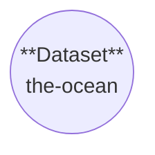
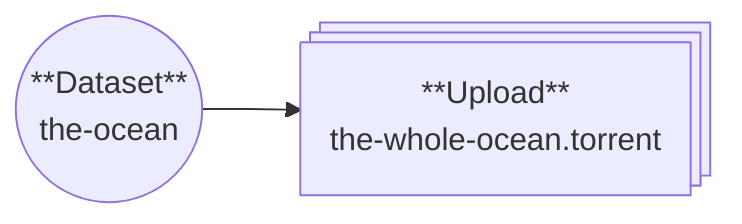
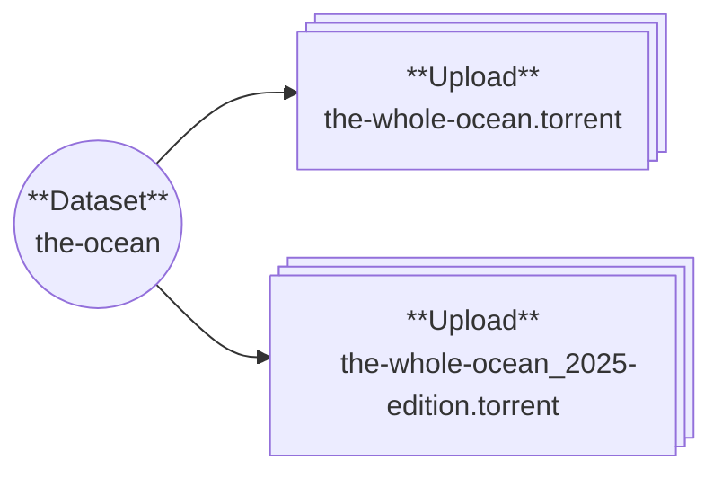
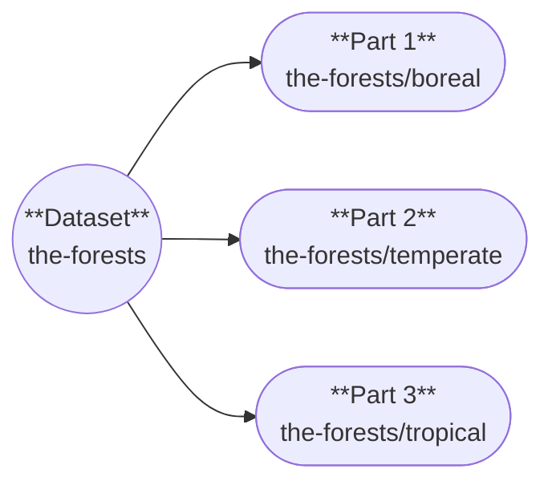
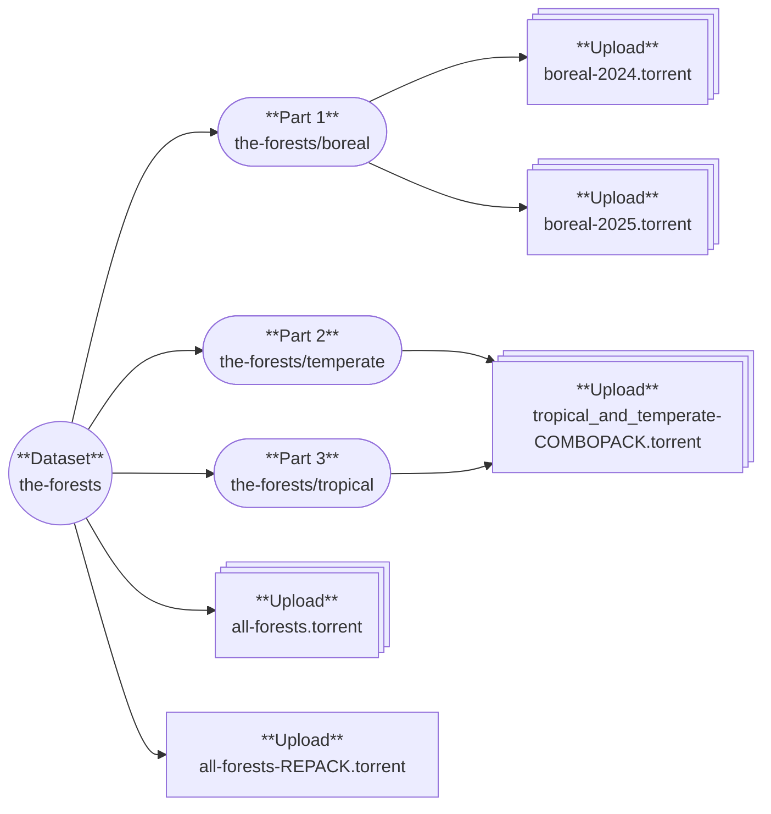
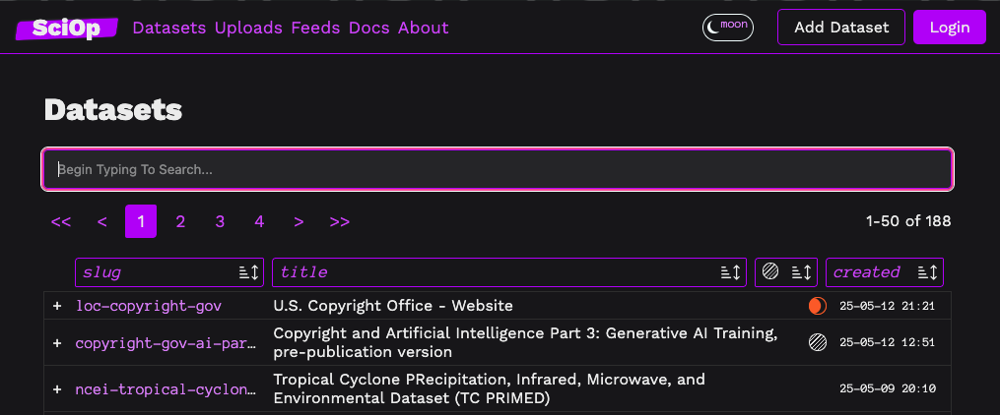
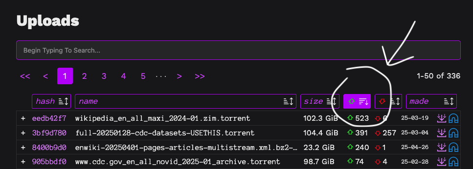
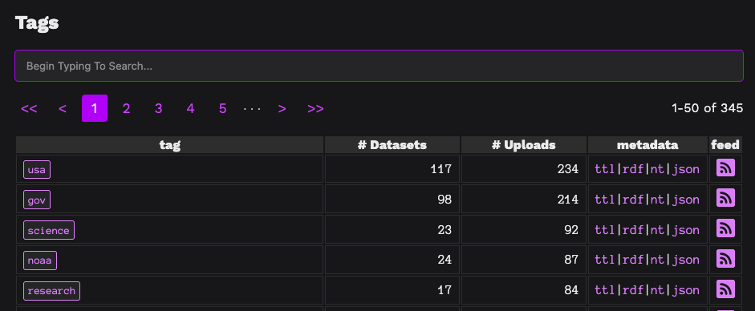

# Browsing

What's even on this website?

## Kinds Of Things

* A [**Dataset**][sciop.models.Dataset] is the basic unit of information,
  the thing that can be referred to (by its [`slug`](#datasets)),
  and holds all the metadata for an item.
* A dataset may have [**Dataset Parts**][sciop.models.DatasetPart].
  These are subdivisions within a larger dataset to organize datasets
  e.g. that might have periodic updates or independent components.
  Some examples are given [below](#dataset-parts)
* An [**Upload**][sciop.models.Upload] is the juice of the site -
  the container for a torrent file (or, in the future, other formats or sources!).
  This is the unit of organization you would expect from other torrent trackers.

## Shapes of Things

### A Dataset

An dataset can exist by itself:

If a dataset hasn't been scraped yet,
or someone knows about it needing to be archived but doesn't have the means to do so themselves,
it can be helpful to create a dataset and leave it open as the future space for uploads.

### Dataset + Upload

Usually though, we have a torrent to upload when we create a dataset,
and the combo of a dataset and upload is the simplest way to do that!

The dataset is the thing that contains the metadata that describes `the-ocean`,
including `tags` that put it in different feeds, who created the ocean,
a description of what it is, and various markers about its preservation status.

Separating datasets and uploads allows us to describe abstract _things_
vs. _instances of things_.

Say, for example, there was a new edition of the ocean.
We can add another torrent to the same dataset - 
an Upload also has fields to describe what it is and how it was created.

### Dataset Parts

If a dataset was very large, or there were natural divisions in it that we might want to make available separately,
we can use **Dataset Parts**

Dataset parts are useful for a few kinds of organization, but their meaning is not prescriptive -
use them however they are useful!

- **Subsets**, which together make up the whole dataset, like `the-forests` example below
- **Versions**, groupings of uploads of the same thing at different periods
- **Releases**, different editions of a dataset, like the annual dump of a dataset
- **Formats**, if something comes as an HTML file, a PDF, a video, and so on,
  dataset parts make an abbreviated namespace like `dataset-name / pdf`
- **...** and so on

### All together...

And all these pieces can be used together! 
An upload can be made for the parent dataset if it has parts,
uploads can be made for its parts --- including spanning multiple parts,
and multiple uploads can exist for each.

In the future we will add additional layers for arbitrary metadata relationships
between datasets, parts, and torrents, but for now they are constrained to this
hierarchy and set of terms. That will let us do interesting things like
share peers and files between multiple torrents, mutable torrents, and so on,
but that's still in the future...

## Finding Things

### Search

The most straightforward way to find things with sciop is to search for them.

Each type of thing, [datasets](/datasets), [uploads](/uploads), and [tags](/feeds) have search bars on their respective pages.

Search uses sqlite's [fts5](https://sqlite.org/fts5.html), and so supports its search syntax.
Search is limited to 3 or more characters at the moment, and is an active area of work!

### Sorting

Each of the columns in a dataset and upload view are sortable, 
which you can use to e.g. find datasets at a certain threat level,
or uploads with a low seed count

### Feeds

Datasets are grouped into [feeds](/feeds) by tag,
so you can find datasets related to a particular topic or 
subscribe to automatically seed them.

Several additional feeds are available for subscribing to seed
torrents by e.g. scarcity, size, and number of seeds.

### Collections

!!! example "Coming Soon"

    We'll get there.

### By Uploader

You can see all the datasets and uploads for an account by visiting its
profile page linked from their items. 

!!! info

    We will be working on account validation and federation after the site
    gains its basic stable functionality, so it will be possible to 
    have signed, validated torrents from identified release groups.

!!! warning

    Enumerating all accounts is currently not possible, and likely will not be.
