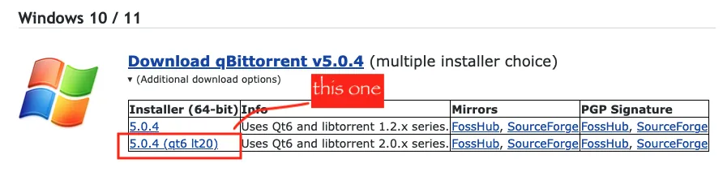

# Torrenting

*this a placeholder, help us out by [making a pull request](/docs/develop/contributing/)
to improve the docs <3*

## Client

A torrent client is what allows you to download and seed torrents.

### Get qbittorrent

**We recommend you use [`qbittorrent`](https://www.qbittorrent.org/) as your torrent client.**

There are currently two versions of qbittorrent for each operating system,
one that uses libtorrent v1, and another that uses libtorrent v2.
Libtorrent v2 allows you to take advantage of [bittorrent v2](https://blog.libtorrent.org/2020/09/bittorrent-v2/),
as well as other improvements in libtorrent 2. 

The v2 version of `qbittorrent` will have "`lt20`" somewhere in its name.

E.g. from qbittorrent.org:

<figure markdown="span">
	
	<figcaption>Seek the `lt20`</figcaption>
</figure>

The desktop version is good if you plan to use it on a regular computer,
but if you plan on running your client on a server or other always-on machine,
you can use [`qbittorrent-nox`](https://github.com/qbittorrent/qBittorrent/wiki/Running-qBittorrent-without-X-server-(WebUI-only,-systemd-service-set-up,-Ubuntu-15.04-or-newer)),
which has a browser-based interface instead of a regular applike interface.

A raspberry pi, qbittorrent-nox, and an external hard drive is a great way to get started
running your own seedbox :).

### Other Options

If `qbittorrent` doesn't work for you for whatever reason, a second option is [`transmission`](https://transmissionbt.com/).

We don't recommend transmission in general, though, 
because it [is not planning on implementing bittorrent v2](https://github.com/transmission/transmission/issues/458),
and has a number of other [odd bugs](https://codeberg.org/Safeguarding/sciop/issues/209).

!!! warning

	There are many other clients that might work,
	but you should *not* use `uTorrent`.
	It has a long history, and while it used to be a good client,
	since its acquisition by BitTorrent Ltd. it has embedded ads,
	tracked users, and been used to mine cryptocurrency.

## Downloading

!!! bug "TODO"
	Write me please!

## Seeding

One of the simplest things you can do to help keep some data safe
is to replicate one or more datasets
by downloading and seeding them via BitTorrent.

!!! note "Overview"
	1. Download and install a BitTorrent client
	2. [Browse the site](browsing.md) and find a dataset that you'd like to replicate
	3. Download the torrent file(s) for one or more of your chosen dataset's uploads
	4. Open the torrent files in your BitTorrent client
	5. Leave your BitTorrent client running to seed the dataset for others
	
!!! bug "TODO"
	Give more details on each step
